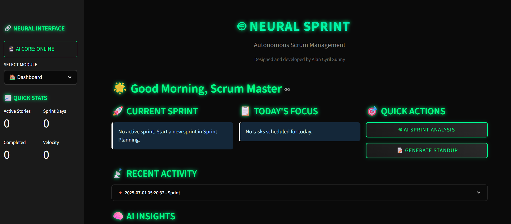

# NeuralSprint




> **Developed by Alan Cyril Sunny**  
> If you find this project helpful, please ⭐ [star the repository](https://github.com/yourusername/neuralsprint)!

---

## 🤖 NeuralSprint

A cyberpunk-themed AI pipeline that automates Scrum Master tasks using your local Qwen3 4B model for efficient, private, and intelligent sprint management.

- 🤖 AI-powered Scrum automation with Qwen3 4B  
- 📅 Smart story estimation, sprint planning, and standup summaries  
- 📈 Advanced analytics: velocity, burndown, bottleneck detection  
- 🖥️ Local deployment—no external dependencies  
- ⚡ GPU-accelerated with CUDA (RTX 2050+)  
- 🔒 100% local processing for privacy and control  

---

## ✨ Features

- **Local AI Processing**: All AI runs on your machine via LM Studio—your data stays private.
- **Smart Story Estimation**: AI estimates story points with detailed reasoning.
- **Automated Sprint Planning**: Generate optimal sprint plans based on team capacity and backlog.
- **Intelligent Standup Summaries**: Create daily standup reports automatically.
- **Retrospective Insights**: Analyze sprint performance and get improvement suggestions.
- **Bottleneck Detection**: Identify workflow impediments and optimization opportunities.
- **Comprehensive Sprint Management**: Plan sprints, manage backlogs, track progress, and run retrospectives.
- **Cyberpunk UI**: Dark theme with neon accents for an immersive experience.
- **Export Capabilities**: Generate and export reports in various formats.
- **Responsive Design**: Works across all screen sizes.

---

## 🛠️ Tech Stack

- **Frontend**: [Streamlit](https://streamlit.io/) with custom cyberpunk CSS
- **AI Model**: Qwen3 4B (via [LM Studio](https://lmstudio.ai/))
- **Data Storage**: JSON-based file system
- **Visualization**: [Plotly](https://plotly.com/) for interactive charts
- **Data Processing**: [Pandas](https://pandas.pydata.org/)

---

## 💻 Requirements

- Python 3.8 or higher
- LM Studio with Qwen3 4B model
- CUDA-compatible GPU (RTX 2050 or better)
- 8GB RAM minimum (16GB recommended)
- 10GB free storage
- Windows, macOS, or Linux

---

## 🚀 Installation

1. *(Optional)* Create and activate a virtual environment:
   ```bash
   python -m venv .venv
   .venv\Scripts\activate   # Windows
   # or
   source .venv/bin/activate   # macOS/Linux
   ```

2. Install the required Python packages:
   ```bash
   pip install streamlit pandas plotly requests
   ```

3. Start LM Studio with the Qwen3 4B model and keep it listening on `http://localhost:1234`.

4. Clone the repository:
   ```bash
   git clone https://github.com/yourusername/neuralsprint.git
   cd neuralsprint
   ```

---

## ⚡ Quick Start

With LM Studio running, launch the app:
```bash
streamlit run neuralsprint_app.py
```

---

## 📝 Usage

1. **Create or import your backlog** using the interface.
2. **Ask the AI** to estimate stories, plan sprints, or summarize standups.
3. **Track progress** with live analytics and charts.
4. **Export reports** as needed.

---

## 💡 Example Prompts

- "Estimate story points for these user stories."
- "Plan the next sprint for a team of 5."
- "Summarize today's standup."
- "Analyze sprint bottlenecks."

---

## 🔒 Note

All AI processing is performed locally using Qwen3 4B via LM Studio, ensuring your data remains private and secure.

---

## 👨‍💻 Developer

**Alan Cyril Sunny**

---

Feel free to fork, star ⭐,
